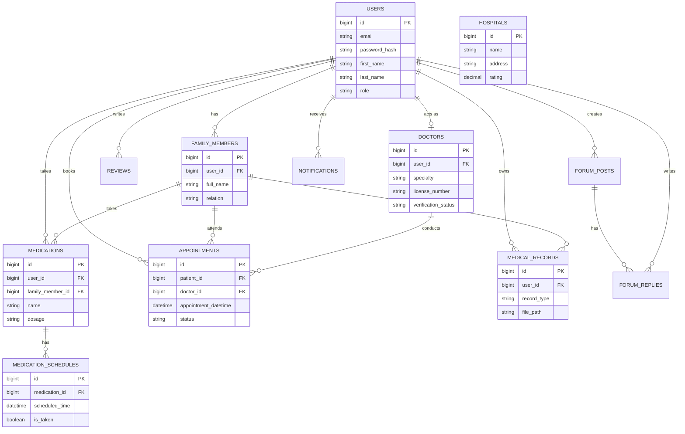

# Medley Smart Health Companion - ER Diagram

```mermaid
erDiagram
    USERS ||--o{ FAMILY_MEMBERS : "has"
    USERS ||--o| DOCTORS : "acts as"
    USERS ||--o{ MEDICATIONS : "takes"
    USERS ||--o{ APPOINTMENTS : "books"
    USERS ||--o{ MEDICAL_RECORDS : "owns"
    USERS ||--o{ REVIEWS : "writes"
    USERS ||--o{ FORUM_POSTS : "creates"
    USERS ||--o{ NOTIFICATIONS : "receives"
    
    FAMILY_MEMBERS ||--o{ MEDICATIONS : "takes"
    FAMILY_MEMBERS ||--o{ APPOINTMENTS : "attends"
    FAMILY_MEMBERS ||--o{ MEDICAL_RECORDS : "owns"

    DOCTORS ||--o{ APPOINTMENTS : "conducts"
    
    MEDICATIONS ||--o{ MEDICATION_SCHEDULES : "has"

    FORUM_POSTS ||--o{ FORUM_REPLIES : "has"
    USERS ||--o{ FORUM_REPLIES : "writes"

    USERS {
        bigint id PK
        string email
        string password_hash
        string first_name
        string last_name
        string role
    }

    FAMILY_MEMBERS {
        bigint id PK
        bigint user_id FK
        string full_name
        string relation
    }

    DOCTORS {
        bigint id PK
        bigint user_id FK
        string specialty
        string license_number
        string verification_status
    }

    MEDICATIONS {
        bigint id PK
        bigint user_id FK
        bigint family_member_id FK
        string name
        string dosage
    }

    MEDICATION_SCHEDULES {
        bigint id PK
        bigint medication_id FK
        datetime scheduled_time
        boolean is_taken
    }

    APPOINTMENTS {
        bigint id PK
        bigint patient_id FK
        bigint doctor_id FK
        datetime appointment_datetime
        string status
    }

    MEDICAL_RECORDS {
        bigint id PK
        bigint user_id FK
        string record_type
        string file_path
    }

    HOSPITALS {
        bigint id PK
        string name
        string address
        decimal rating
    }
```
